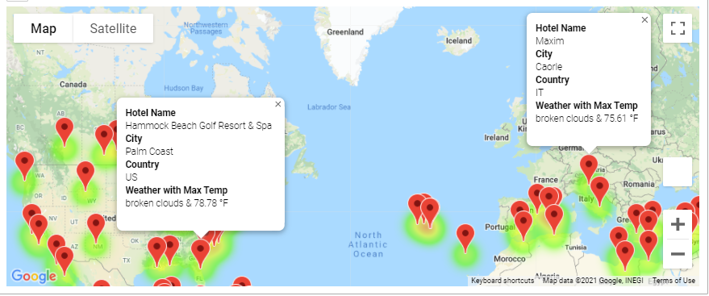
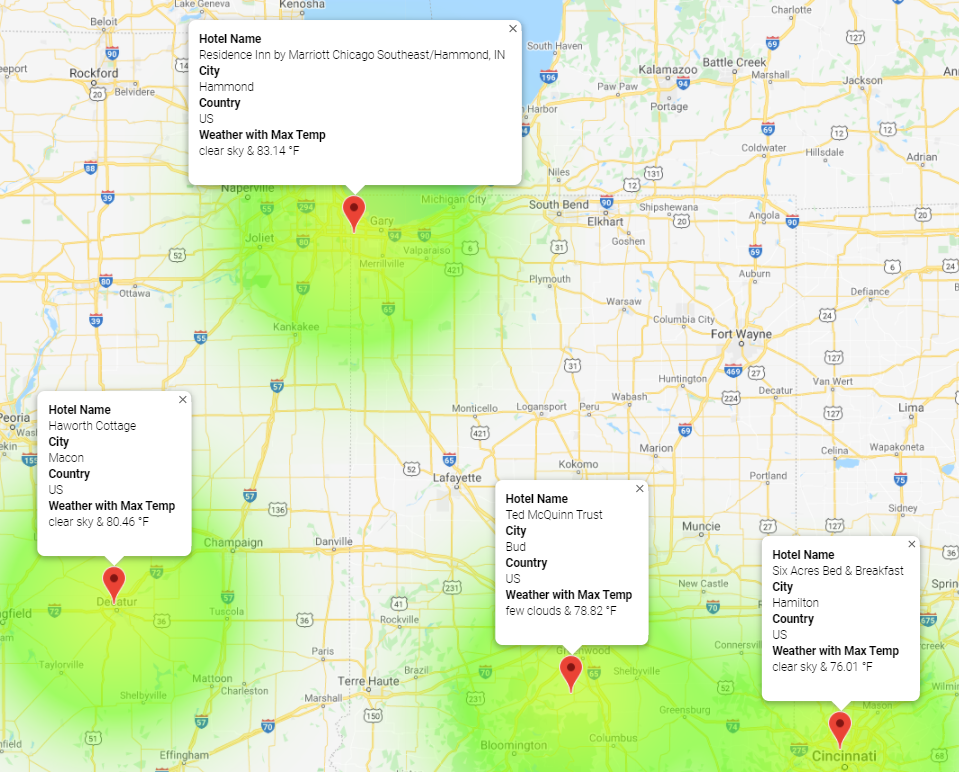

# World Weather Analysis
## Overview
PlanMyTrip is a travel app in the Hotel/Lodging industry that allows its customers to use a search page to filter on preferred travel criterion to find their ideal hotel anywhere in the world.  The site will perform requests using several APIs to match the customer requests such as places that meet tempaerature ranges they input as well as predicting the best times to travel, etc. 
## Resources
Data:  various .csv files 
Software(s):  Python 3.7, Jupyter Lab 3.0.14, Pandas, NumPy, SciPy, CitiPy, Matplotlib,  Google Maps API, Google Places API, OpenWeatherMap API
## Summary
Customers can filter their requests and a heatmap, with pop-up markers, similar to the one below, will display their results. 
 
Customers can build an itinerary with several stops and view maps reflecting their choices. 
 
Pop-up markers are also included so that a customer can click on a location and certain data will display as shown below. 
 
